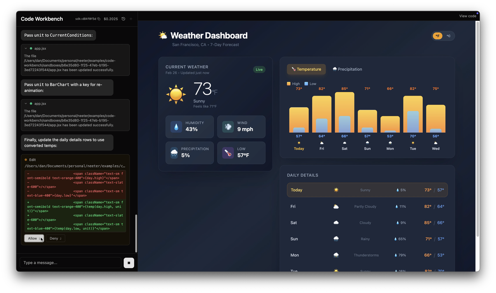
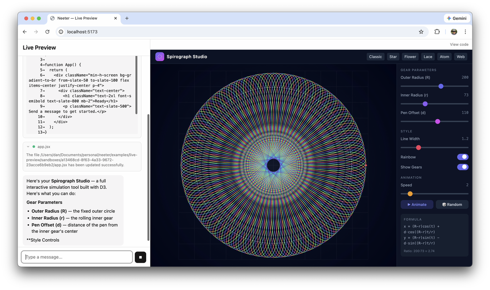

# neeter

[](https://github.com/quantumleeps/neeter/actions/workflows/ci.yml)
[](https://www.npmjs.com/package/@neeter/server)
[](https://www.npmjs.com/package/@neeter/core)
[](https://www.npmjs.com/package/@neeter/react)
[](https://www.npmjs.com/package/@neeter/types)
[](./LICENSE)
[](https://www.typescriptlang.org/)
[](https://quantumleeps.github.io/neeter/docs)

The same agentic loop that powers Claude Code — now in your browser. A React + Hono toolkit that streams tool calls, file edits, permissions, and multi-turn sessions over SSE into ready-made React components.

<p align="center">
  
</p>

## Why neeter

The Claude Agent SDK gives you a powerful agentic loop — but it's a server-side `AsyncGenerator` with no opinion on how to get those events to a browser. neeter bridges that gap:

| Feature | What it does |
|---------|-------------|
| **Multi-turn sessions** | `PushChannel` + `SessionManager` let users send messages at any time — no "wait for the agent to finish" lockout |
| **Named SSE events** | `MessageTranslator` reshapes the SDK's flat stream into semantic events (`text_delta`, `tool_start`, `tool_call`, `tool_result`, ...) that `EventSource` can route natively |
| **Tool lifecycle** | Tool calls move through `pending` → `streaming_input` → `running` → `complete` with streaming JSON input for progressive rendering |
| **Custom events** | Hook into tool results with `onToolResult` and emit typed `{ name, value }` events for app-specific reactivity |
| **Browser-side approval** | `PermissionGate` bridges the SDK's server-side `canUseTool` callback to the browser — the agent blocks until the user clicks Allow/Deny |
| **Session persistence** | Resume past conversations with pluggable `SessionStore`. Built-in JSONL store with `replayEvents` for UI reconstruction |
| **11 built-in widgets** | Purpose-built React components for every SDK tool — diffs, bash output, web search, todos, and more |

## Built-in widgets

<p align="center">
  
  
  
</p>
<p align="center">
  
  
  
</p>

Edit diffs, web search with favicon pills, bash output, todo checklists, extended thinking, and tool approval — all streaming in real time. See the [full widget docs](https://quantumleeps.github.io/neeter/docs/built-in-widgets).

## Install

```bash
# Server
pnpm add @neeter/server

# Client
pnpm add @neeter/react
```

Peer dependencies — **server**:

```json
{
  "@anthropic-ai/claude-agent-sdk": ">=0.2.0",
  "hono": ">=4.0.0"
}
```

Peer dependencies — **client**:

```json
{
  "react": ">=18.0.0",
  "react-markdown": ">=10.0.0",
  "zustand": ">=5.0.0",
  "immer": ">=10.0.0",
  "tailwindcss": ">=4.0.0"
}
```

## Quick start

### Server

The Claude Agent SDK reads your API key from the environment automatically. Make sure it's set before starting your server:

```bash
export ANTHROPIC_API_KEY=your-api-key
```

```typescript
import { Hono } from "hono";
import { serve } from "@hono/node-server";
import {
  createAgentRouter,
  SessionManager,
  MessageTranslator,
} from "@neeter/server";

const sessions = new SessionManager(() => ({
  context: {},
  model: "claude-sonnet-4-5-20250929",
  systemPrompt: "You are a helpful assistant.",
  maxTurns: 50,
}));

const translator = new MessageTranslator();

const app = new Hono();
app.route("/", createAgentRouter({ sessions, translator }));

serve({ fetch: app.fetch, port: 3000 });
```

> Endpoints, session context, permissions, extended thinking, persistence, and sandbox hooks are covered in the [Server Guide](https://quantumleeps.github.io/neeter/docs/server).

### Client

```tsx
import { AgentProvider, MessageList, ChatInput, useAgentContext } from "@neeter/react";

function App() {
  return (
    <AgentProvider>
      <Chat />
    </AgentProvider>
  );
}

function Chat() {
  const { sendMessage } = useAgentContext();

  return (
    <div className="flex h-screen flex-col">
      <MessageList className="flex-1" />
      <ChatInput onSend={sendMessage} />
    </div>
  );
}
```

Components use Tailwind utility classes and accept `className` for overrides.

> Styling, custom events, widgets, and the SSE protocol are covered in the [Client Guide](https://quantumleeps.github.io/neeter/docs/client).

## What you can build

<p align="center">
  
</p>

The spirograph studio above was built by Opus 4.6 using the [code-workbench](examples/code-workbench) example — a split-pane coding assistant with live preview, per-session sandboxes, file checkpointing, and session resume.

## Examples

| Example | Description |
|---------|-------------|
| **[basic-chat](examples/basic-chat)** | Minimal chat UI — `AgentProvider` + `MessageList` + `ChatInput` |
| **[code-workbench](examples/code-workbench)** | Split-pane coding assistant with live preview, per-session sandboxes, persistence, file checkpointing, and code viewer |

## Documentation

| Guide | What it covers |
|-------|----------------|
| [Server Guide](https://quantumleeps.github.io/neeter/docs/server) | Endpoints, session context, permissions, thinking, persistence, sandbox |
| [Client Guide](https://quantumleeps.github.io/neeter/docs/client) | Styling, custom events, widgets, tool lifecycle, SSE protocol |
| [Built-in Widgets](https://quantumleeps.github.io/neeter/docs/built-in-widgets) | The 11 SDK tool widgets and how to override them |
| [Custom Widgets](https://quantumleeps.github.io/neeter/docs/custom-widgets) | Registering your own tool widgets |
| [API Reference](https://quantumleeps.github.io/neeter/docs/api-reference) | All exports and types for server, core, react, and types packages |
| [Development](https://quantumleeps.github.io/neeter/docs/development) | Local setup, pre-commit hooks, CI |

## License

MIT
