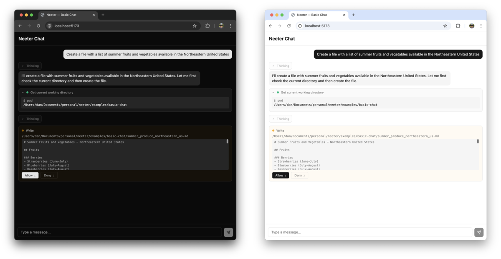

# Client Guide

> Part of [neeter](../README.md). See [all docs](../README.md#documentation).

`@neeter/react` provides a drop-in chat UI that connects to your `@neeter/server` backend over SSE.

## Custom events

If your server emits custom events (via `onToolResult` — see [Server Guide](server.md#reacting-to-tool-results)), handle them with `onCustomEvent`:

```tsx
<AgentProvider
  onCustomEvent={(e) => {
    if (e.name === "notes_updated") {
      myStore.getState().setNotes(e.value);
    }
  }}
>
  <Chat />
</AgentProvider>
```

Each event is a typed `CustomEvent<T>` with `name` and `value` fields.

## Widgets

When you add tools to your `SessionManager`, neeter automatically renders them with purpose-built widgets — diff views for edits, code blocks for file reads, expandable link pills for web searches, and so on. No configuration needed.

- **[Built-in widgets](built-in-widgets.md)** — what ships out of the box for the 11 supported SDK tools, how approval previews work, and how to extend or override them
- **[Custom widgets](custom-widgets.md)** — register your own components for MCP tools or app-specific rendering

Tool calls without a registered widget fall back to a minimal status indicator.

## Tool call lifecycle

Each tool call moves through phases, reflected in `WidgetProps.phase`:

| Phase | Trigger | What's available |
|-------|---------|-----------------:|
| `pending` | `tool_start` SSE event | `input: {}` |
| `streaming_input` | `tool_input_delta` events | `partialInput` accumulates |
| `running` | `tool_call` event (input finalized) | `input` is complete |
| `complete` | `tool_result` event | `result` is JSON-parsed |
| `error` | Error during execution | `error` message |

## Styling

Neeter components use Tailwind v4 utility classes and [shadcn/ui](https://ui.shadcn.com)-compatible CSS variable names (`bg-primary`, `text-muted-foreground`, `border-border`, etc.).

### With shadcn/ui

Your existing theme variables are already compatible. Add one line to your main CSS so Tailwind scans neeter's component source for utility classes:

```css
@import "tailwindcss";
@source "../node_modules/@neeter/react/dist";
```

The `@source` path is relative to your CSS file — adjust if your stylesheet lives in a nested directory (e.g. `../../node_modules/@neeter/react/dist`).

### Without shadcn/ui

Import the bundled theme, which includes source scanning automatically:

```css
@import "tailwindcss";
@import "@neeter/react/theme.css";
```

This provides a neutral OKLCH palette with light + dark mode support and the Tailwind v4 `@theme inline` variable bridge.

### Dark mode

Dark mode activates via:
- `.dark` class on `<html>` (recommended), or
- `prefers-color-scheme: dark` system preference (automatic)

Add `.light` to `<html>` to force light mode when using system preference detection.

<p>
  
</p>

### Switching to shadcn later

Drop the `@neeter/react/theme.css` import and add `@source` — your shadcn theme takes over with zero migration.

## SSE events

Events emitted by the server, handled automatically by `useAgent`:

| Event | Payload | Description |
|-------|---------|-------------|
| `message_start` | `{}` | Agent began generating a response |
| `thinking_start` | `{}` | Extended thinking block began |
| `thinking_delta` | `{ text }` | Streaming thinking text chunk |
| `text_delta` | `{ text }` | Streaming text chunk |
| `tool_start` | `{ id, name }` | Agent began calling a tool |
| `tool_input_delta` | `{ id, partialJson }` | Streaming tool input JSON |
| `tool_call` | `{ id, name, input }` | Tool input finalized |
| `tool_result` | `{ toolUseId, result }` | Tool execution result |
| `tool_progress` | `{ toolName, elapsed }` | Long-running tool heartbeat |
| `permission_request` | `PermissionRequest` | Tool approval or user question awaiting response |
| `session_init` | `{ sdkSessionId, model, tools }` | SDK session initialized — provides the persistent session ID |
| `turn_complete` | `{ numTurns, cost, stopReason, usage, modelUsage }` | Agent turn finished with stop reason, token usage, and per-model costs |
| `custom` | `{ name, value }` | App-specific event from `onToolResult` |
| `session_error` | `{ subtype, stopReason }` | Session ended with error |

---

See also: [Server Guide](server.md) | [API Reference](api-reference.md) | [Built-in Widgets](built-in-widgets.md) | [Custom Widgets](custom-widgets.md)
