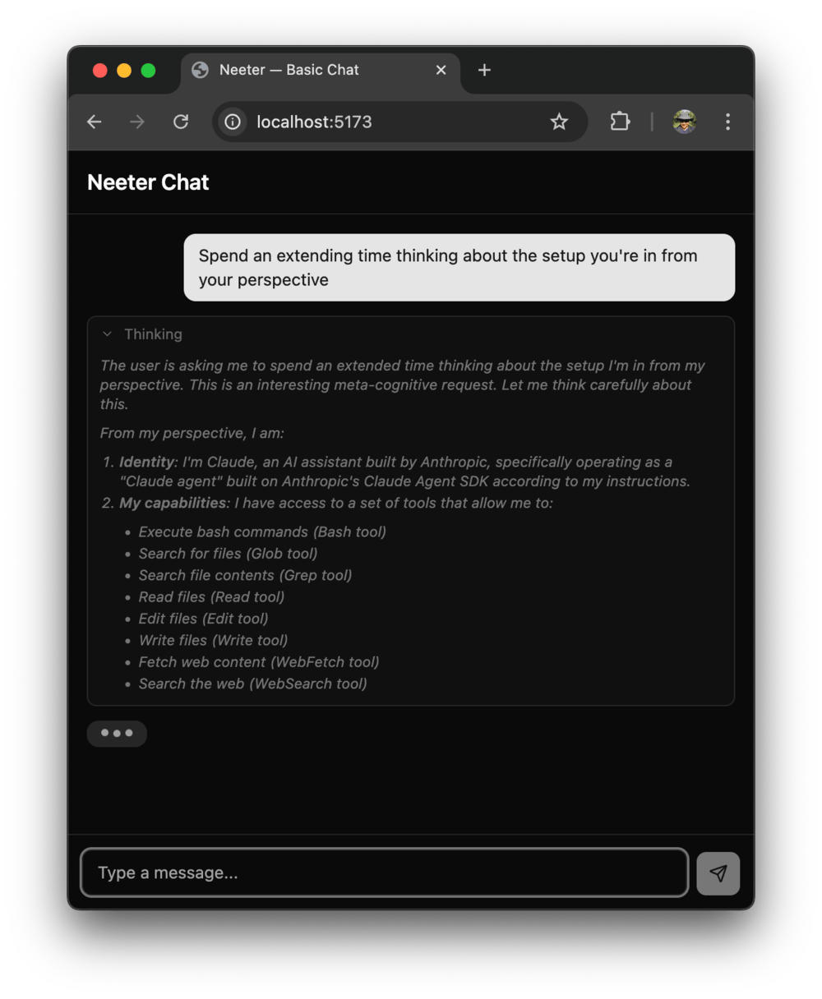
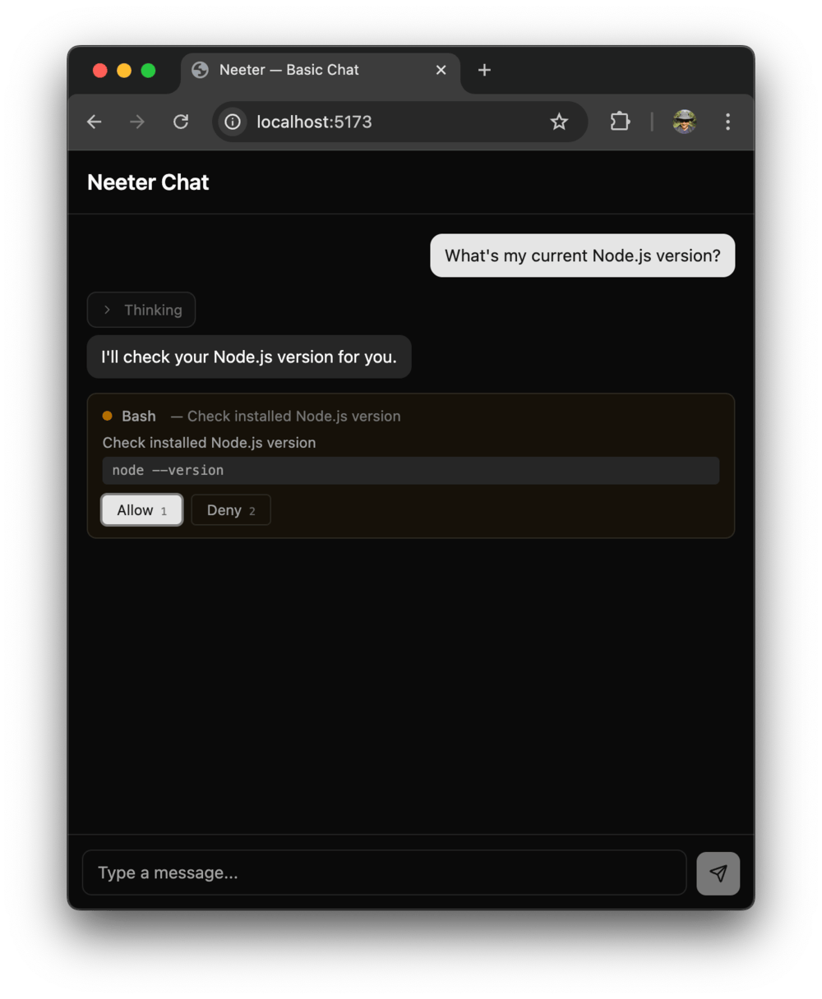
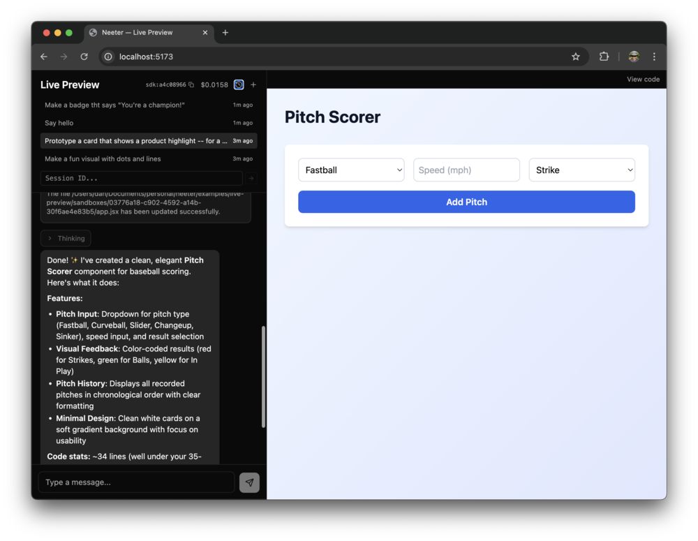

# Server Guide

> Part of [neeter](../README.md). See [all docs](../README.md#documentation).

`@neeter/server` gives you a Hono router that manages Agent SDK sessions and streams events to the client over SSE.

## Endpoints

`createAgentRouter` mounts eight endpoints (default base path: `/api`):

| Method | Path | Description |
|--------|------|-------------|
| `POST` | `/api/sessions` | Create a session, returns `{ sessionId }` |
| `POST` | `/api/sessions/resume` | Resume or fork a session by SDK session ID |
| `GET` | `/api/sessions/history` | List previous sessions |
| `GET` | `/api/sessions/replay/:sdkSessionId` | Load persisted events for UI replay |
| `POST` | `/api/sessions/:id/messages` | Send a message — text or multimodal content |
| `GET` | `/api/sessions/:id/events` | SSE stream of agent events |
| `POST` | `/api/sessions/:id/permissions` | Respond to a permission request (see [Permissions](#permissions)) |
| `POST` | `/api/sessions/:id/abort` | Abort the current agent turn |

## System prompt

`systemPrompt` accepts a plain string or the Claude Code preset object. The preset includes built-in safety instructions, tool-usage guidance, and environment context — use `append` to layer on your own instructions:

```typescript
// Plain string — full control, no built-in behavior
const sessions = new SessionManager(() => ({
  context: {},
  model: "claude-sonnet-4-5-20250929",
  systemPrompt: "You are a helpful assistant.",
}));

// Preset — Claude Code defaults + your additions
const sessions = new SessionManager(() => ({
  context: {},
  model: "claude-sonnet-4-5-20250929",
  systemPrompt: {
    type: "preset",
    preset: "claude_code",
    append: "You are a helpful assistant that can look up Pokémon.",
  },
}));
```

## Extended thinking

Enable Claude's chain-of-thought reasoning by setting `thinking` in your session config:

```typescript
const sessions = new SessionManager(() => ({
  context: {},
  model: "claude-sonnet-4-5-20250929",
  systemPrompt: "You are a helpful assistant.",
  thinking: { type: "enabled", budgetTokens: 10000 },
}));
```

| Config | Behavior |
|--------|----------|
| `{ type: "enabled", budgetTokens: N }` | Fixed thinking budget — useful for cost control |
| `{ type: "adaptive" }` | Let the model decide how much to think (Opus 4.6+) |
| `{ type: "disabled" }` | Explicitly off (this is also the default) |

When thinking is enabled, the Agent SDK suppresses `StreamEvent` messages — the translator falls back to extracting text, thinking, and tool-use blocks from complete `AssistantMessage` objects. The client receives the same `thinking_delta` and `text_delta` SSE events either way, so components like `MessageList` and `ThinkingBlock` work without any special handling.

<p>
  
</p>

## Multimodal messages

The messages endpoint accepts plain text or structured content arrays with text and image blocks:

```bash
# Plain text (unchanged)
curl -X POST /api/sessions/:id/messages \
  -d '{ "text": "Hello" }'

# Text + image
curl -X POST /api/sessions/:id/messages \
  -d '{
    "content": [
      { "type": "text", "text": "Describe this diagram" },
      {
        "type": "image",
        "source": {
          "type": "base64",
          "media_type": "image/png",
          "data": "<base64-encoded data>"
        }
      }
    ]
  }'
```

When `content` is provided it takes precedence over `text`. Supported image media types: `image/jpeg`, `image/png`, `image/gif`, `image/webp`.

On the server side, `session.pushMessage()` now accepts `string | ContentBlock[]`:

```typescript
// Text-only (backward compatible)
session.pushMessage("Hello");

// Multimodal
session.pushMessage([
  { type: "text", text: "What's in this image?" },
  {
    type: "image",
    source: { type: "base64", media_type: "image/png", data: pngBase64 },
  },
]);
```

The `extractText()` helper pulls the text portion from either form — useful for display or logging:

```typescript
import { extractText } from "@neeter/server";

extractText("Hello");                        // "Hello"
extractText([{ type: "text", text: "Hi" }]); // "Hi"
```

## Session context

`SessionManager` takes a factory function that runs once per session. The generic type parameter lets you attach per-session state:

```typescript
interface MyContext {
  history: string[];
}

const sessions = new SessionManager<MyContext>(() => ({
  context: { history: [] },
  model: "claude-sonnet-4-5-20250929",
  systemPrompt: "You are a helpful assistant.",
  mcpServers: { myServer: createMyServer() },
  allowedTools: ["mcp__myServer__*"],
  maxTurns: 100,
}));
```

The context is available in translator hooks (see below).

## Reacting to tool results

Use `onToolResult` to inspect what the agent did and emit structured custom events:

```typescript
const translator = new MessageTranslator<MyContext>({
  onToolResult: (toolName, result, session) => {
    if (toolName === "save_note") {
      session.context.history.push(result);
      return [{ name: "notes_updated", value: session.context.history }];
    }
    return [];
  },
});
```

Each returned `{ name, value }` object is sent to the client as a `custom` SSE event. See [Custom events](client.md#custom-events) for the client-side handling.

## Permissions

By default sessions run with `permissionMode: "default"` — every tool call requires explicit browser-side approval. Set `permissionMode` to `"bypassPermissions"` to auto-approve all tools, or `"acceptEdits"` for a middle ground:

```typescript
const sessions = new SessionManager(() => ({
  context: {},
  model: "claude-sonnet-4-5-20250929",
  systemPrompt: "You are a helpful assistant.",
  permissionMode: "bypassPermissions",
}));
```

<p>
  
</p>

When `permissionMode` is not `"bypassPermissions"`:

1. Every tool call blocks the SDK until the user responds
2. `AskUserQuestion` calls surface as structured questions with options
3. `permission_request` SSE events fire to the client
4. The user's response is POSTed back to `/api/sessions/:id/permissions`

The `PermissionGate` on each session manages the deferred promises internally — no additional wiring needed.

| Mode | Behavior |
|------|----------|
| `"bypassPermissions"` | All tools auto-approved |
| `"default"` | Every tool call requires explicit approval (default) |
| `"acceptEdits"` | File edits auto-approved, other tools require approval |
| `"plan"` | Planning mode — SDK-defined behavior |

Tools listed in `allowedTools` are pre-approved by the SDK and skip the permission prompt, even when `permissionMode` is `"default"`. This lets you auto-approve safe operations while still gating destructive ones:

```typescript
const sessions = new SessionManager(() => ({
  context: {},
  model: "claude-sonnet-4-5-20250929",
  systemPrompt: "You are a helpful assistant.",
  tools: ["Read", "Write", "Edit", "Glob", "Grep"],
  allowedTools: ["Read", "Glob", "Grep"],  // auto-approved
  // Write and Edit will still require browser approval
}));
```

## Session resume & persistence

<p>
  
</p>

The Claude Agent SDK persists conversations on disk and supports resuming them. `SessionManager` captures the SDK-assigned session ID (delivered via a `session_init` SSE event) and exposes methods for resuming past sessions and browsing history.

**In-memory history** works out of the box — `listHistory()` returns sessions that are still in memory:

```typescript
const sessions = new SessionManager(() => ({
  context: {},
  model: "claude-sonnet-4-5-20250929",
  systemPrompt: "You are a helpful assistant.",
}));
```

**Persistent history** survives server restarts. Pass a `SessionStore` implementation to the constructor:

```typescript
import { createJsonSessionStore, SessionManager } from "@neeter/server";

const sessions = new SessionManager(
  () => ({
    context: {},
    model: "claude-sonnet-4-5-20250929",
    systemPrompt: "You are a helpful assistant.",
  }),
  { store: createJsonSessionStore("./data") },
);
```

`createJsonSessionStore` writes append-only JSONL event logs and JSON metadata sidecars to the given directory. On the client, `replayEvents` reconstructs the chat UI from stored events — the same store actions used by the live SSE stream, so rendering is identical.

The `SessionStore` interface is pluggable — implement `save`, `load`, `list`, and `delete` to back it with a database instead of the filesystem.

> **Security note:** `createJsonSessionStore` writes conversation data — including tool inputs and outputs — to disk unencrypted. Use it for development and trusted environments. See the [code-workbench](../examples/code-workbench) example for a complete persistence setup.

## Sandbox hook

`createSandboxHook` restricts file operations to a specific directory. It inspects `file_path` and `path` fields in tool input and blocks any resolved path that falls outside the sandbox:

```typescript
import { resolve } from "node:path";
import { createSandboxHook, SessionManager } from "@neeter/server";

const sandboxDir = resolve("./sandboxes/user-123");

const sessions = new SessionManager(() => ({
  context: {},
  model: "claude-sonnet-4-5-20250929",
  systemPrompt: "You are a helpful assistant.",
  hooks: { PreToolUse: createSandboxHook(sandboxDir, resolve) },
}));
```

Bash is blocked by default — shell commands can reference paths outside the sandbox in ways that can't be reliably detected. Set `{ allowBash: true }` only when using OS-level isolation (containers, VMs, or `@anthropic-ai/sandbox-runtime`).

See the [code-workbench](../examples/code-workbench) example for a complete sandboxing setup.

---

See also: [Client Guide](client.md) | [API Reference](api-reference.md) | [Built-in Widgets](built-in-widgets.md)
